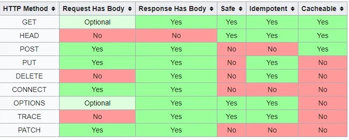

## HTTP Request Methods

**GET**

데이터를 서버에서 가져올 떄 사용

ex) 사용자 정보 가져오기, 상품 목록 조회

**POST**

서버에 데이터를 전송하여 새로운 리소스를 생성하거나 특정 작업을 수행

ex) 회원 가입, 게시글 작성

*리소스 : 웹에서 다루는 모든 데이터나 파일 같은 것

**PUT**

서버에 데이터를 전송하여 기존 리소스를 수정하거나 새로운 리소스를 생성

ex) 회원 정보 수정, 게시글 수정

**DELETE**

서버에서 특정 리소스를 삭제

ex) 계정 삭제, 게시글 삭제

**PATCH**

리소스의 일부만 수정

ex) 사용자 비밀번호 수정

**OPTIONS**

서버와 클라이언트 간의 연결 설정을 확인

ex) CORS 정책 확인

*CORS(Cross-Origin Resource Sharing) : 다른 도메인 간의 요청을 허용하거나 제한하는 보안 메커니즘

**TRACE**

Request 리소스가 수신되는 경로를 보기 위함

ex) 네트워크 디버깅 및 테스트

**HEAD**

리소스 유무 확인 (GET과 동일하지만 응답 본문을 반환받지 않는다.)

ex)서버에서 파일이 존재하는지 확인