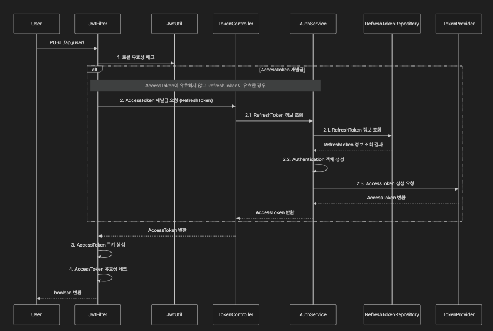

## JWT (JSON Web Token)

---

- JWT는 두 개체(ex: 클라이언트와 서버)간 정보를 안전하게 전달하기 위한 웹 표준(RFC 7519)이다.
- 로그인 인증과 API 보안 등에 자주 사용되며 Header, Payload, Signature의 세 부분으로 구성된다.

**Header (헤더)**

- 토큰 타입(typ)과 해싱 알고리즘(alg) 두가지 정보를 지니고 있다.

ex)

```jsx
{
  "typ": "JWT",
  "alg": "HS256"
}
```

**Payload (페이로드)**

- 토큰에 담길 정보(Claim클레임)를 포함
- 클레임은 크게 세분류로 나눠진다.
등록된 클레임 : 표준화된 정보 (ex: exp-만료시간, iat-발급시간, iss-토큰 발급자 등)
공개 클레임 : URI 형식으로 충돌 방지된 정보
비공개 클레임 : 양측 간 합의된 데이터

ex)

```json
{
  "sub": "Test Title",
  "name": "Song",
  "admin": true
}
```

**Signature (서명)**

헤더의 인코딩값과 정보의 인코딩 값을 합친 후 주어진 비밀키로 해쉬를 하여 생성한다. 이렇게 만든 해쉬를 base64 형태로 나타내게 된다.

*인코딩 : 데이터를 변환(원본→ 다른 형식)
*디코딩 : 변환된 테이터를 복원(다른 형식 → 원본)

*base64 : 데이터를 텍스트 형식으로 변환하는 인코딩 방식, 주로 안전한 전송과 저장을 위해 사용된다.

### 로그인 인증 시 JWT 사용

**인증과 인가의 예시**

| **구분** | **인증 (Authentication)** | **인가 (Authorization)** |
| --- | --- | --- |
| **목적** | 사용자가 누구인지 확인 | 사용자가 특정 자원에 접근할 권한 확인 |
| **시점** | 로그인 시 수행 | 인증 후 요청마다 수행 |
| **검증 대상** | 사용자 자격 증명 (이메일/비밀번호, 토큰) | 사용자 권한 (JWT의 역할, 권한 정보) |
| **결과** | Access Token 발급 | 자원에 대한 접근 허용/거부 |
| **예시** | 이메일과 비밀번호로 로그인 | 관리자 전용 API 호출 (`role: admin`) |



**JWT를 이용한 Access Token 재발급 간략한 흐름**

1. **토큰 유효성 확인:**
    - 클라이언트가 API 요청을 보냄.
    - `JwtFilter`가 Access Token의 유효성을 검사.
2. **Access Token이 만료된 경우:**
    - `JwtFilter`가 Refresh Token을 사용하여 재발급 요청.
    - `TokenController`가 `AuthService`를 호출하여 토큰 처리.
3. **Refresh Token 검증 및 Access Token 생성:**
    - `AuthService`가 Refresh Token의 유효성을 확인 (`RefreshTokenRepository` 호출).
    - 유효하면 새로운 Access Token을 생성 (`TokenProvider` 호출).
4. **Access Token 반환 및 쿠키 생성:**
    - 재발급된 Access Token을 클라이언트로 전달.
    - 쿠키에 Access Token 저장 후 요청을 처리.

Access Token 만료 시, Refresh Token을 사용해 새로운 Access Token을 발급받아 클라이언트에 전달하는 과정

**요약**

JWT는 인증(사용자 확인)과 인가(권한 확인)를 처리하며,
Access Token 만료 시 Refresh Token을 통해 새로운 Access Token을 발급받아 보안을 유지한다.