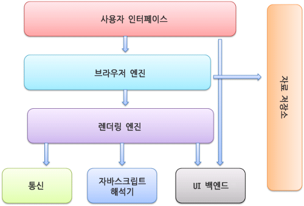
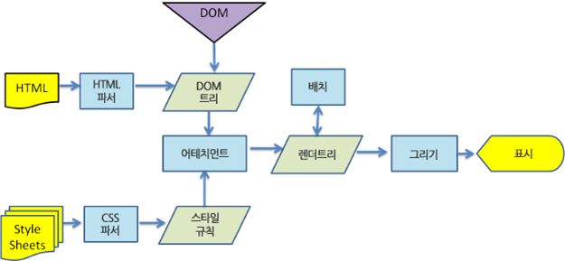

### 브라우저 기본 구조

---



**사용자 인터페이스** (UI : User Interface)

사용자가 브라우저를 조작할 수 있는 화면과 버튼
ex) 주소 표시줄, 이전/다음 버튼, 북마크 등

*사용자 경험(UX : User eXperience) : 사용자들의 경험을 분석하여 더 편하고 효율적인 방향으로 프로세스가 진행 될 수 있도록 만드는 것 (ex: 터치 화면, 사용자의 선택 flow 등)

**브라우저 엔진**

사용자 인터페이스를 통해 사용자의 명령을 받아 렌더링 엔진과 통신하며 웹페이지를 표시하는 역할

**렌더링 엔진**

요청한 콘텐츠 표시 ( HTML, CSS를 파싱해서 화면에 표시) ⇒ HTML, CSS를 분석해 화면에 예쁘게 그려주는 역할

*렌더링(Rendering) 이란? 웹 브라우저가 HTML(제목, 이미지, 텍스트 등), CSS(색상, 크기, 위치), JavaScript(버튼 클릭, 동작 등) 같은 코드를 읽어서 우리가 볼 수 있는 화면으로 변환하는 과정

*파싱 (Parsing) 이란? 데이터를 특정 규칙에 따라 분석하고 프로그래밍적으로 처리할 수 있도록 변환하는 과정ex)

```jsx
const jsonString = '{"name:":"Song", "age":28}';

const parsedData = JSON.parse(jsonString);

console.log(parsedData.name); // 출력 : Song
```

**통신**

인터넷(네트워크)을 통해 서버에서 데이터를 주고받는 역할을 한다.

**자바스크립트 해석기**

웹페이지에서 동작하는 JS 코드를 이해하고 실행한다.

**자료 저장소**

쿠키, 캐시 같은 데이터를 하드디스크에 저장하는 계틍

**DOM (Document Object Model : 문서 객체 모델)**




DOM은 웹페이지의 구조를 표현한 트리 모양의 지도라고 할 수 있다.

브라우저가 HTML 파일을 읽어서 DOM이라는 형태로 변환한다.

예시 코드)

HTML 코드:

```jsx
<!DOCTYPE html>
<html>
  <head>
    <title>My Page</title>
  </head>
  <body>
    <h1>Hello World!</h1>
    <p>This is a paragraph.</p>
  </body>
</html>
```

HTML 코드를 DOM 트리 구조로 변환:

```jsx
- html (루트 노드)
  ├── head
  │     └── title
  │            └── "My Page" (텍스트 노드)
  └── body
        ├── h1
        │     └── "Hello World!" (텍스트 노드)
        └── p
              └── "This is a paragraph." (텍스트 노드)
```

DOM의 사용이유 : 각 태그가 부모와 자식 관계를 지니기 때문에 이를 트리 구조로 표현하고, JS를 통해 특정 노드를 쉽게 찾고 수정할 수 있도록 사용한다.

### 요약

- URL입력으로 브라우저가 서버에 Request(요청)을 보내고, 서버는 HTML, CSS, 이미지 같은 자원을 Response(응답)로 보냄
- 랜더링 엔진 작동으로 HTML과 CSS를 해석해 브라우저가 화면에 페이지를 표시하도록 준비
- HTML 파싱을 통해 HTML 문서를 분석해 DOM트리 (문서 구조)를 만든다.
- CSS 파일을 분석해 스타일 정보를 만듦
- DOM 트리와 CSS 정보를 합쳐 화면에 표시할 구조를 만듦
- 렌더 트리를 기반으로 요소를 배치하고 UI 백엔드가 화면에 그린다. 자원을 모두 기다리지 않고 먼저 받은 부분부터 화면에 표시한다.(점진적 렌더링)